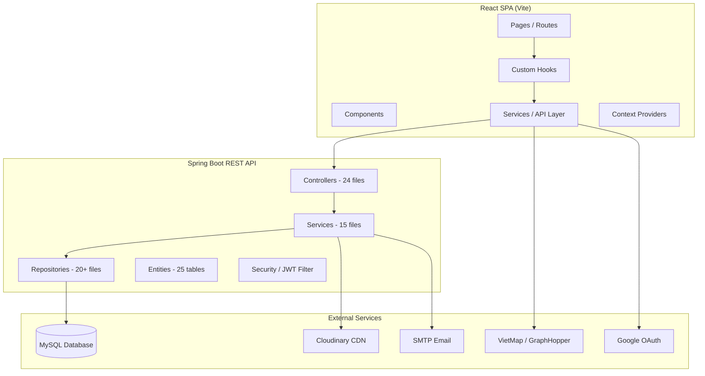

# GREVO — Báo Cáo Tổng Hợp Dự Án

> Tài liệu này tổng hợp toàn bộ thông tin kỹ thuật của hệ thống GREVO (Green Revolution) — nền tảng quản lý thu gom rác thải thông minh.

---

## 1. TỔNG QUAN DỰ ÁN

| Thông số | Chi tiết |
|---|---|
| **Tên dự án** | GREVO — Green Revolution |
| **Mô tả** | Nền tảng quản lý thu gom rác thải thông minh, kết nối citizen → enterprise → collector |
| **Loại ứng dụng** | Full-stack Web Application (SPA + REST API) |
| **Mô hình** | Multi-role RBAC (4 roles) |
| **Ngày cập nhật** | 2026-04-02 |

---

## 2. CÔNG NGHỆ SỬ DỤNG

### 2.1 Frontend

| Công nghệ | Version | Mục đích |
|---|---|---|
| **React** | 18.x | UI framework (SPA) |
| **Vite** | 5.x | Build tool + dev server |
| **React Router** | 6.x | Client-side routing |
| **TailwindCSS** | 3.x | Utility-first CSS framework |
| **MapLibre GL** | 4.x | Map rendering (open-source Mapbox fork) |
| **Axios** | 1.x | HTTP client |
| **Chart.js** | 4.x | Biểu đồ thống kê |
| **Google Fonts** | — | Typography (Inter, Outfit) |
| **Material Symbols** | — | Icon system |

### 2.2 Backend

| Công nghệ | Version | Mục đích |
|---|---|---|
| **Java** | 17+ | Ngôn ngữ chính |
| **Spring Boot** | 3.x | Application framework |
| **Spring Security** | 6.x | Authentication & Authorization |
| **Spring Data JPA** | 3.x | ORM + Repository pattern |
| **JWT** | — | Token-based authentication |
| **MySQL** | 8.x | Relational database |
| **Cloudinary** | — | Image upload/storage (CDN) |
| **JavaMailSender** | — | Email sending (OTP, reset password) |
| **Lombok** | — | Boilerplate reduction |
| **Maven** | — | Build & dependency management |

### 2.3 External APIs

| API | Mục đích |
|---|---|
| **VietMap API** | Geocoding, reverse geocoding, address autocomplete |
| **GraphHopper API** | Route calculation, turn-by-turn directions |
| **Carto Positron** | Map tile layer (light mode) |
| **Google OAuth 2.0** | Social login |
| **Cloudinary** | Image hosting CDN |

---

## 3. KIẾN TRÚC HỆ THỐNG

---

## 4. THỐNG KÊ ENDPOINTS

### Tổng số: 89 endpoints (24 controllers)

| Controller | Base Path | GET | POST | PUT | DELETE | Tổng |
|---|---|---|---|---|---|---|
| AuthController | `/api/auth` | 0 | 5 | 0 | 0 | **5** |
| UserController | `/api/users` | 1 | 4 | 1 | 2 | **8** |
| WasteReportController | `/api/reports` | 7 | 3 | 1 | 0 | **11** |
| CollectorTaskController | `/api/collector/tasks` | 2 | 4 | 0 | 0 | **6** |
| CollectorProfileController | `/api/collector/profile` | 2 | 1 | 1 | 0 | **4** |
| CollectorEnterpriseController | `/api/collector/enterprise` | 2 | 2 | 0 | 1 | **5** |
| EnterpriseController | `/api/enterprises` | 3 | 1 | 1 | 0 | **5** |
| EnterpriseCollectorController | `/api/enterprises/me/collectors` | 2 | 2 | 1 | 1 | **6** |
| EnterpriseScopeController | `/api/enterprises/me/scope` | 2 | 1 | 0 | 1 | **4** |
| VoucherController | `/api/enterprise/vouchers` | 2 | 2 | 1 | 1 | **6** |
| PointRulesController | `/api/enterprise/point-rules` | 2 | 1 | 1 | 1 | **5** |
| RewardsController | `/api/rewards` | 2 | 1 | 0 | 0 | **3** |
| PointHistoryController | `/api/citizen/point-history` | 2 | 0 | 0 | 0 | **2** |
| LeaderboardController | `/api/leaderboard` | 1 | 0 | 0 | 0 | **1** |
| FeedbackController | `/api` | 1 | 1 | 0 | 0 | **2** |
| SystemFeedbackController | `/api` | 2 | 2 | 1 | 1 | **6** |
| LocationController | `/api/location` | 2 | 1 | 0 | 0 | **3** |
| LocationSessionController | `/api/location-sessions` | 1 | 1 | 1 | 0 | **3** |
| SavedLocationController | `/api/users/saved-locations` | 1 | 1 | 0 | 1 | **3** |
| AdminUserController | `/api/admin/users` | 1 | 1 | 1 | 0 | **3** |
| AdminServiceAreaController | `/api/admin/areas` | 1 | 1 | 0 | 1 | **3** |
| AdminEnterpriseController | `/api/admin/enterprises` | 1 | 1 | 1 | 0 | **3** |
| AdminEnterpriseAreaController | `/api/admin/enterprises` | 1 | 1 | 0 | 1 | **3** |
| SystemLogController | `/api/admin/logs` | 1 | 0 | 0 | 0 | **1** |

---

## 5. CƠ SỞ DỮ LIỆU

### 5.1 Tổng số: 25 entities / tables

| Bảng | Mô tả | Quan hệ chính |
|---|---|---|
| `users` | Tất cả user (4 roles) | 1-1 → citizens/collectors/enterprise |
| `citizens` | Thông tin citizen | N-1 → users |
| `collectors` | Thông tin collector | N-1 → users, N-1 → enterprise |
| `enterprise` | Thông tin enterprise | N-1 → users |
| `service_areas` | Khu vực dịch vụ (polygon) | — |
| `enterprise_area` | Gán area cho enterprise | N-1 → enterprise, N-1 → service_areas |
| `waste_types` | Loại rác (Organic, Plastic,...) | — |
| `waste_reports` | Báo cáo rác thải | N-1 → citizens, N-1 → service_areas |
| `waste_report_image` | Ảnh evidence | N-1 → waste_reports |
| `collector_assignments` | Gán collector cho report | N-1 → waste_reports, N-1 → collectors |
| `collector_requests` | Yêu cầu join enterprise | N-1 → collectors, N-1 → enterprise |
| `feedback` | Rating citizen ↔ collector | N-1 → waste_reports, N-1 → collectors/citizens |
| `feedback_image` | Ảnh kèm feedback | N-1 → feedback |
| `report_lifecycle` | Timeline thay đổi status | N-1 → waste_reports |
| `status_history` | Lịch sử status chung | N-1 → waste_reports |
| `point_rules` | Quy tắc tính điểm | N-1 → enterprise |
| `point_transactions` | Lịch sử cộng/trừ điểm | N-1 → citizens, N-1 → waste_reports |
| `rewards` | Phần thưởng hệ thống | — |
| `vouchers` | Voucher do enterprise tạo | N-1 → enterprise |
| `voucher_redemptions` | Lịch sử đổi voucher | N-1 → vouchers, N-1 → citizens |
| `notification` | Thông báo | N-1 → users |
| `saved_locations` | Vị trí đã lưu | N-1 → users |
| `location_sessions` | Phiên QR scan | N-1 → users |
| `system_feedbacks` | Feedback từ user về hệ thống | N-1 → users |
| `system_logs` | Log hệ thống | — |

### 5.2 Cập nhật ERD gần nhất

- ✅ Thêm field `version` (BIGINT) vào bảng `collector_assignments` — phục vụ optimistic locking (JPA `@Version`)

---

## 6. THỐNG KÊ MÃ NGUỒN

### 6.1 Frontend

| Thư mục | Số file | Mô tả |
|---|---|---|
| `pages/` | 18 page files | Các trang chính |
| `components/sections/` | 70+ component files | UI components theo role |
| `components/common/` | 13 shared components | Reusable UI |
| `components/layout/` | 10 layout components | Navigation, sidebar |
| `hooks/` | 65+ custom hooks | Business logic |
| `services/` | 17 service files | API integration |
| `context/` | 4 context providers | Auth, Language, Refresh, Toast |

### 6.2 Backend

| Thư mục | Số file | Mô tả |
|---|---|---|
| `controller/` | 24 controllers | REST endpoints |
| `service/impl/` | ~15 service impls | Business logic |
| `repository/` | ~20 repositories | Data access |
| `entity/` | 25 entities | Database models |
| `dto/` | ~30 DTOs | Request/Response objects |
| `config/` | ~5 configs | Security, CORS, etc. |

---

## 7. TÍNH NĂNG NỔI BẬT

### 🗺 Multi-Collector Assignment
- Enterprise có thể gán nhiều collector cho 1 report
- Tự động phân chia trọng lượng (fill smallest first)
- State machine phức tạp: mỗi collector có lifecycle riêng
- Report chỉ COLLECTED khi tổng weight đủ

### 📍 Location QR Scan
- Citizen scan QR code → tạo LocationSession
- Auto-fill GPS vào form báo cáo
- Session tự hết hạn sau 15 phút

### 🗺 Route Map Navigation
- MapLibre GL + GraphHopper turn-by-turn
- Single dest mode (từ task) + Multi dest mode (nhiều task)
- Real-time navigation steps

### 💰 Dynamic Point System
- Enterprise tự tạo Point Rules (per kg, quality bonus, quantity bonus)
- Tự động tính điểm khi report COLLECTED
- Leaderboard xếp hạng citizen theo tuần

### 🎁 Voucher Marketplace
- Enterprise tạo voucher với hình ảnh + điều kiện
- Citizen đổi điểm lấy voucher → redemption code
- Track redemption history

### 🔐 Full Auth System
- JWT token-based authentication
- Google OAuth 2.0 integration
- Email verification OTP
- Password reset via email link
- Profile completion tracking

### 🌍 Premium Map UI
- Tesla-inspired light mode design
- Custom markers with colored borders
- Carto Positron vector tiles
- Address autocomplete via VietMap API

### 💬 Two-way System Feedback
- User submit feedback (rating, category, description, images)
- Admin can respond with message
- Status tracking (NEW → REVIEWED)

### 📊 Role-based Dashboards
- Mỗi role có dashboard riêng với stats, charts, recent activity
- Admin: system-wide overview + role distribution
- Enterprise: collector chart + revenue chart
- Collector: capacity + status + active task map
- Citizen: points + active request tracker

---

## 8. DESIGN PATTERNS

| Pattern | Áp dụng |
|---|---|
| **Repository Pattern** | Spring Data JPA repositories |
| **Service Layer** | Business logic tách khỏi controllers |
| **Custom Hooks** | React logic extraction + composition |
| **Context API** | Global state (Auth, Toast, Refresh) |
| **DTO Pattern** | Request/Response objects tách entity |
| **Builder Pattern** | Entity construction (Lombok @Builder) |
| **Optimistic Locking** | @Version trên CollectorAssignment |
| **Idempotent Guards** | Point awarding, feedback submission |
| **Role-based Access** | Spring Security + JWT role filter |
