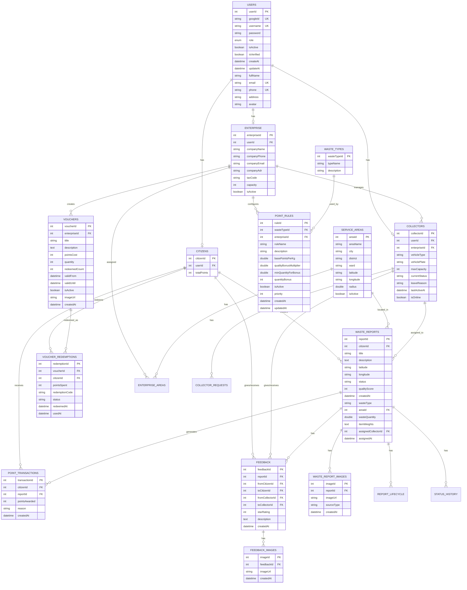

# 📊 Sơ Đồ Entity Relationship (ER Diagram)

## Tổng Quan

Hệ thống Grevo Solutions sử dụng **MySQL** làm cơ sở dữ liệu chính với các bảng được thiết kế theo mô hình quan hệ.

---

## Sơ Đồ ER



---

## Quan Hệ Giữa Các Bảng

### 1. Users & Role-specific Tables

| Quan hệ | Mô tả |
|---------|-------|
| `USERS` → `CITIZENS` | 1:1, User có role CITIZEN |
| `USERS` → `COLLECTORS` | 1:1, User có role COLLECTOR |
| `USERS` → `ENTERPRISE` | 1:1, User có role ENTERPRISE |

### 2. Enterprise & Collectors

| Quan hệ | Mô tả |
|---------|-------|
| `ENTERPRISE` → `COLLECTORS` | 1:N, Doanh nghiệp có nhiều collector |
| `COLLECTORS` → `COLLECTOR_REQUESTS` | 1:N, Collector có nhiều yêu cầu |

### 3. Waste Reports

| Quan hệ | Mô tả |
|---------|-------|
| `CITIZENS` → `WASTE_REPORTS` | 1:N, Citizen tạo nhiều báo cáo |
| `COLLECTORS` → `WASTE_REPORTS` | 1:N, Collector được phân công nhiều báo cáo |
| `SERVICE_AREAS` → `WASTE_REPORTS` | 1:N, Khu vực có nhiều báo cáo |
| `WASTE_REPORTS` → `WASTE_REPORT_IMAGES` | 1:N, Báo cáo có nhiều hình ảnh |

### 4. Points & Rewards

| Quan hệ | Mô tả |
|---------|-------|
| `CITIZENS` → `POINT_TRANSACTIONS` | 1:N, Citizen có nhiều giao dịch điểm |
| `WASTE_REPORTS` → `POINT_TRANSACTIONS` | 1:N, Báo cáo tạo ra điểm |
| `VOUCHERS` → `VOUCHER_REDEMPTIONS` | 1:N, Voucher được đổi nhiều lần |

### 5. Feedback

| Quan hệ | Mô tả |
|---------|-------|
| `WASTE_REPORTS` → `FEEDBACK` | 1:N, Báo cáo có feedback |
| `FEEDBACK` → `FEEDBACK_IMAGES` | 1:N, Feedback có hình ảnh |

---

## Enum Values

### Role (trong USERS)

```
CITIZEN     - Công dân
ENTERPRISE  - Doanh nghiệp
COLLECTOR   - Nhân viên thu gom
ADMIN       - Quản trị viên
```

### Report Status (trong WASTE_REPORTS)

```
PENDING     - Chờ xử lý
ASSIGNED    - Đã phân công
ON_THE_WAY  - Đang trên đường
COLLECTED   - Đã thu gom
CANCELLED   - Đã hủy
```

### Waste Type

```
ORGANIC     - Rác hữu cơ
RECYCLABLE  - Rác tái chế
HAZARDOUS   - Rác nguy hại
GENERAL     - Rác thông thường
```

### Voucher Redemption Status

```
ACTIVE      - Đang hoạt động
USED        - Đã sử dụng
EXPIRED     - Hết hạn
```

### Collector Status

```
AVAILABLE   - Sẵn sàng
BUSY        - Đang bận
PENDING     - Chờ duyệt
PENDING_LEAVE - Chờ duyệt nghỉ phép
ON_LEAVE    - Đang nghỉ
INACTIVE    - Không hoạt động
```

---

## Liên Hệ

- **Email**: pnhat.se@gmail.com
- **Đơn vị phát triển**: Grevo Team

---

© 2026 Grevo Solutions. Bảo lưu mọi quyền.
