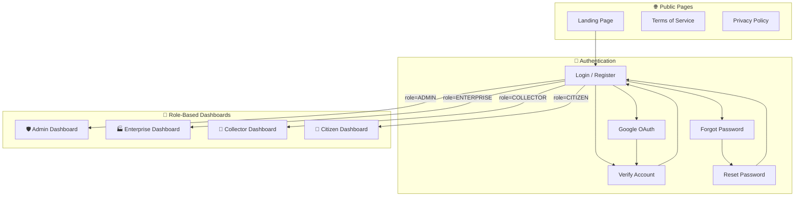
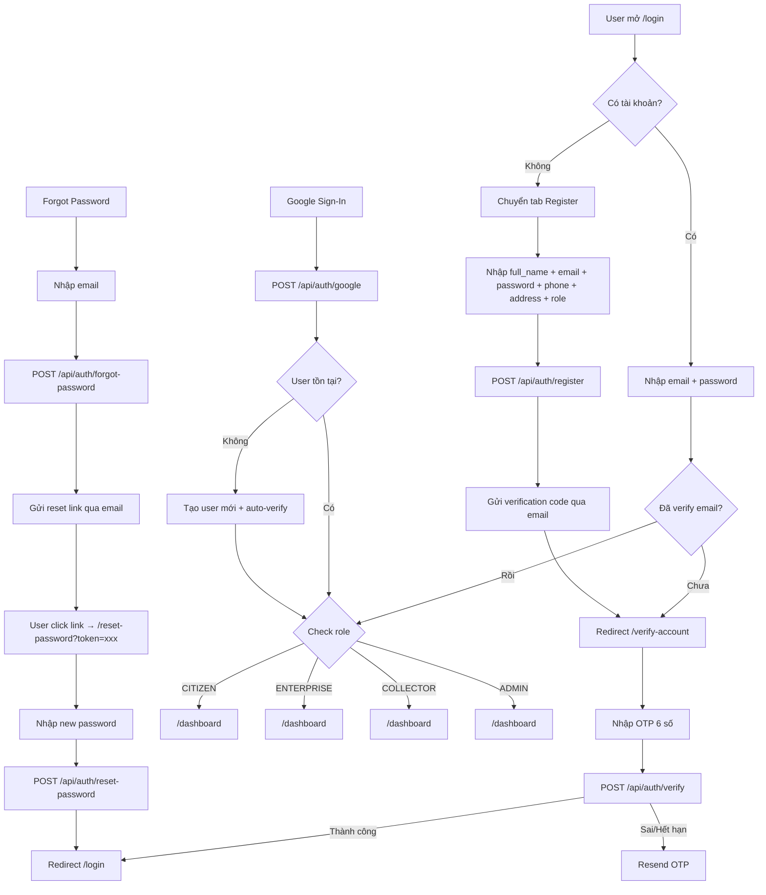
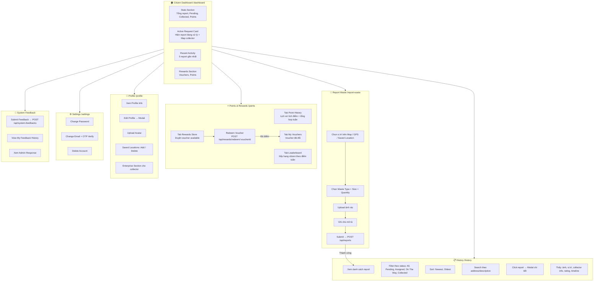
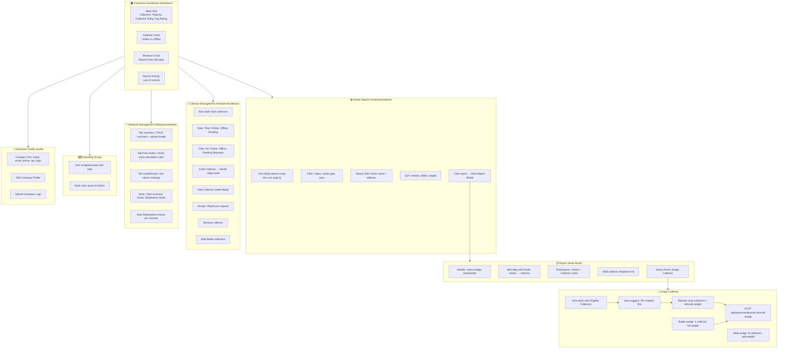
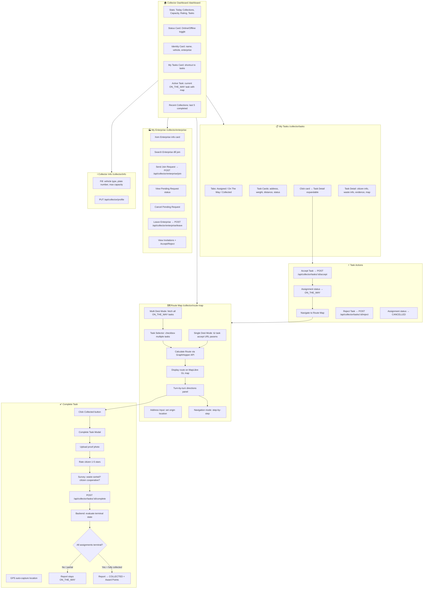
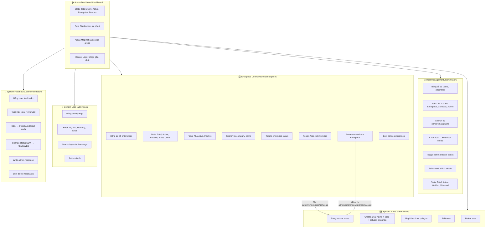
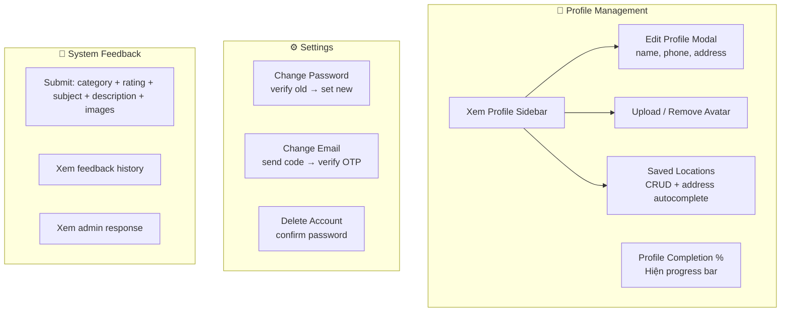

# GREVO — Toàn Bộ UserFlow (4 Roles)

> Tài liệu này mô tả toàn bộ luồng hoạt động (user flow) của hệ thống GREVO cho tất cả các vai trò: **Admin**, **Enterprise**, **Collector**, **Citizen**, và các luồng **Public/Auth**.

---

## 1. TỔNG QUAN HỆ THỐNG

---

## 2. AUTHENTICATION FLOW

---

## 3. CITIZEN USERFLOW

---

## 4. ENTERPRISE USERFLOW

---

## 5. COLLECTOR USERFLOW

---

## 6. ADMIN USERFLOW

---

## 7. SHARED / CROSS-ROLE FLOWS

```mermaid
flowchart TD
    subgraph WasteReport["🔄 Waste Report Lifecycle"]
        WR_PENDING[PENDING<br/>Citizen tạo report]
        WR_ASSIGNED[ASSIGNED<br/>Enterprise gán collector]
        WR_OTW[ON_THE_WAY<br/>Collector accept task]
        WR_COLLECTED[COLLECTED<br/>Tất cả collector hoàn thành]
        WR_CANCELLED[CANCELLED<br/>Enterprise cancel]

        WR_PENDING --> WR_ASSIGNED
        WR_ASSIGNED --> WR_OTW
        WR_OTW --> WR_COLLECTED
        WR_ASSIGNED --> WR_CANCELLED
        WR_OTW --> WR_CANCELLED
    end

    subgraph MultiCollector["🔀 Multi-Collector Assignment"]
        MC1[Enterprise chọn N collectors]
        MC2[Phân chia weight cho mỗi collector]
        MC3[Mỗi collector có assignment riêng]
        MC4[Collector A hoàn thành → checked]
        MC5[Collector B hoàn thành → checked]
        MC6{Sum weight ≥ report weight?}
        MC7[Report → COLLECTED]
        MC8[Report stays ON_THE_WAY<br/>Enterprise re-assign gap]

        MC1 --> MC2 --> MC3
        MC3 --> MC4
        MC3 --> MC5
        MC4 --> MC6
        MC5 --> MC6
        MC6 -->|Yes| MC7
        MC6 -->|No gap| MC8
    end

    subgraph LocationFlow["📍 Location QR Scan"]
        LQ1[Citizen scan QR code chứa /report-waste?session=xxx]
        LQ2[Backend: create LocationSession]
        LQ3[Citizen: update GPS → PUT session/location]
        LQ4[Auto-fill address vào report form]
        LQ5[Session expires sau 15 phút]

        LQ1 --> LQ2 --> LQ3 --> LQ4
        LQ2 --> LQ5
    end

    subgraph PointsCycle["💰 Points Cycle"]
        PC1[Report COLLECTED]
        PC2[Backend: calculateAndAwardPoints]
        PC3[Match Point Rules by enterprise + waste type]
        PC4[Calculate: base × weight × quality bonus]
        PC5[Award points to citizen]
        PC6[Create PointTransaction record]
        PC7[Citizen xem điểm → Redeem voucher]

        PC1 --> PC2 --> PC3 --> PC4 --> PC5 --> PC6 --> PC7
    end

    subgraph CollectorJoin["🤝 Collector ↔ Enterprise"]
        CJ1[Collector search enterprise]
        CJ2[Send join request]
        CJ3[Enterprise review request]
        CJ4{Accept or Reject?}
        CJ5[Collector thuộc enterprise]
        CJ6[Rejected → thông báo]
        CJ7[Enterprise invite collector]
        CJ8[Collector xem invitation]
        CJ9[Accept invitation]

        CJ1 --> CJ2 --> CJ3 --> CJ4
        CJ4 -->|Accept| CJ5
        CJ4 -->|Reject| CJ6
        CJ7 --> CJ8 --> CJ9 --> CJ5
    end
```

---

## 8. PROFILE & SETTINGS FLOW (Shared All Roles)

