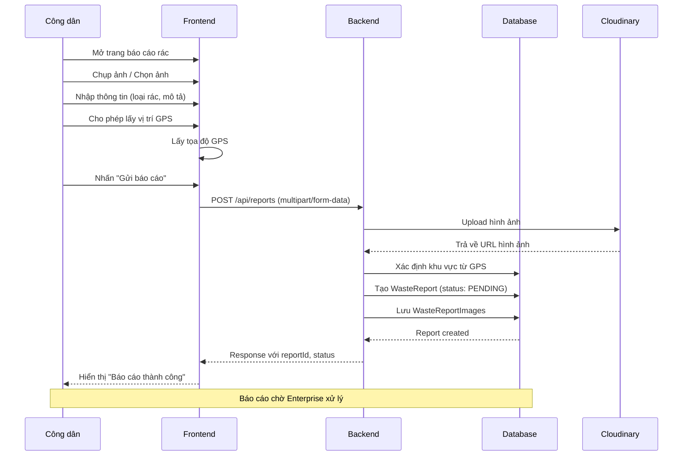
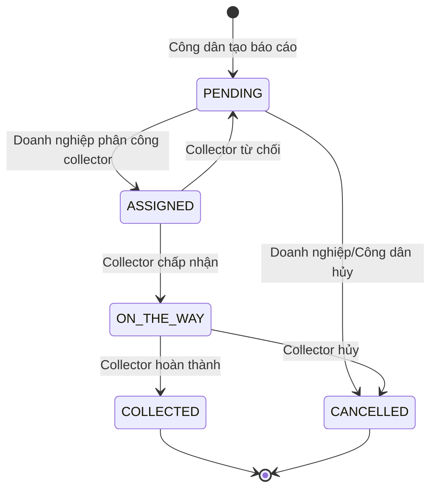

# 🔄 Luồng Báo Cáo Rác Thải

## Tổng Quan

Luồng báo cáo rác thải là quy trình chính của hệ thống, cho phép công dân tạo báo cáo và theo dõi quá trình thu gom.

---

## Sơ Đồ Luồng



---

## Chi Tiết Các Bước

### Bước 1: Công Dân Tạo Báo Cáo

**Actor**: Công dân (CITIZEN)

**Dữ liệu đầu vào:**
| Trường | Bắt buộc | Mô tả |
|--------|----------|-------|
| title | ✅ | Tiêu đề báo cáo |
| description | ❌ | Mô tả chi tiết |
| wasteType | ✅ | ORGANIC/RECYCLABLE/HAZARDOUS/GENERAL |
| wasteQuantity | ❌ | Khối lượng ước tính (kg) |
| latitude | ✅ | Vĩ độ GPS |
| longitude | ✅ | Kinh độ GPS |
| images | ❌ | Hình ảnh (tối đa 5) |
| itemWeights | ❌ | Chi tiết từng loại rác (JSON) |

**Xử lý:**
1. Frontend lấy tọa độ GPS từ trình duyệt
2. Người dùng chọn/chụp ảnh rác thải
3. Điền thông tin loại rác và mô tả
4. Gửi request multipart/form-data lên server

---

### Bước 2: Backend Xử Lý

**Xử lý Server:**
1. Xác thực JWT token → lấy thông tin Citizen
2. Upload hình ảnh lên Cloudinary → nhận URL
3. Xác định khu vực (ServiceArea) từ tọa độ GPS
4. Tạo record WasteReports với status = `PENDING`
5. Tạo record WasteReportImages cho từng ảnh (sourceType = `CITIZEN`)
6. Trả về response với thông tin báo cáo

---

### Bước 3: Báo Cáo Chờ Xử Lý

**Trạng thái**: `PENDING`

Báo cáo hiển thị trong danh sách của:
- Công dân: "Đang chờ xử lý"
- Doanh nghiệp phụ trách khu vực: "Báo cáo mới cần phân công"

---

## Sơ Đồ Trạng Thái Báo Cáo



---

## Dữ Liệu Mẫu

### Request Tạo Báo Cáo

```json
{
    "title": "Rác thải tái chế khu chung cư Sunrise",
    "description": "Chai nhựa, lon nhôm, giấy carton đã phân loại sẵn",
    "wasteType": "RECYCLABLE",
    "wasteQuantity": 5.0,
    "latitude": "10.7769",
    "longitude": "106.7009",
    "itemWeights": "[{\"type\":\"Nhựa\",\"weight\":2.5},{\"type\":\"Giấy\",\"weight\":2.5}]"
}
```

### Response Thành Công

```json
{
    "reportId": 123,
    "title": "Rác thải tái chế khu chung cư Sunrise",
    "wasteType": "RECYCLABLE",
    "status": "PENDING",
    "createdAt": "2026-01-21T06:30:00"
}
```

---

## Validation Rules

| Rule | Mô tả |
|------|-------|
| Title | Tối thiểu 10 ký tự, tối đa 255 ký tự |
| GPS | Phải nằm trong vùng phục vụ |
| Images | Tối đa 5 ảnh, mỗi ảnh < 5MB |
| WasteType | Phải thuộc danh sách cho phép |

---

## Liên Hệ

- **Email**: pnhat.se@gmail.com
- **Đơn vị phát triển**: Grevo Team

---

© 2026 Grevo Solutions. Bảo lưu mọi quyền.
