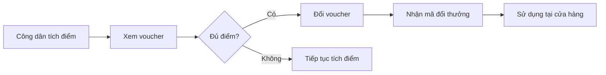
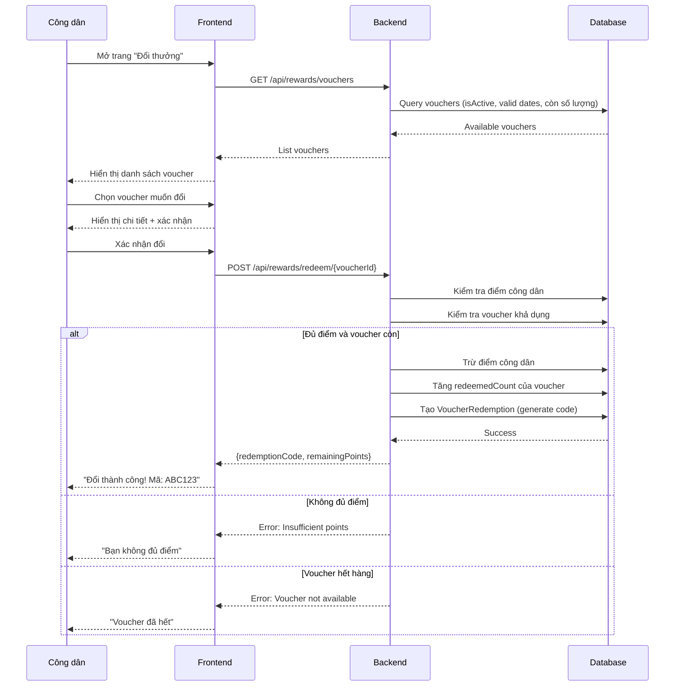
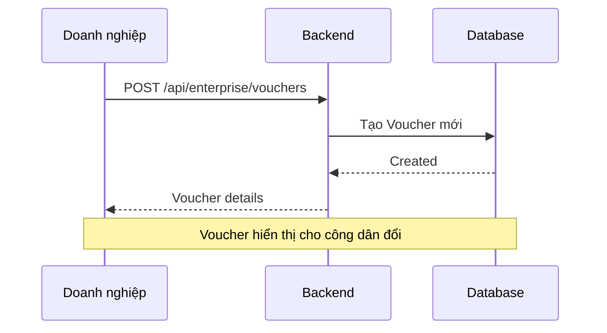

# 🎁 Luồng Đổi Voucher

## Tổng Quan

Công dân sử dụng điểm tích lũy để đổi voucher từ các doanh nghiệp trong hệ thống.

---

## Sơ Đồ Tổng Quan



---

## Sơ Đồ Luồng Chi Tiết



---

## Chi Tiết Các Bước

### Bước 1: Xem Voucher Có Sẵn

**API**: `GET /api/rewards/vouchers`

**Điều kiện voucher hiển thị:**
- `isActive = true`
- `validFrom <= now <= validUntil`
- `quantity = null OR redeemedCount < quantity`

**Response mẫu:**
```json
[
    {
        "voucherId": 1,
        "enterpriseName": "ABC Mart",
        "title": "Giảm 50,000đ",
        "description": "Đơn hàng từ 200,000đ",
        "pointsCost": 500,
        "remainingStock": 55,
        "validUntil": "2026-12-31",
        "isAvailable": true,
        "imageUrl": "https://..."
    }
]
```

---

### Bước 2: Đổi Voucher

**API**: `POST /api/rewards/redeem/{voucherId}`

**Validation:**
1. ✅ Citizen tồn tại và active
2. ✅ Voucher tồn tại
3. ✅ `citizen.totalPoints >= voucher.pointsCost`
4. ✅ Voucher đang active và trong thời hạn
5. ✅ Voucher còn số lượng (nếu có giới hạn)

**Xử lý thành công:**
1. Trừ điểm: `citizen.totalPoints -= pointsCost`
2. Tăng đếm: `voucher.redeemedCount += 1`
3. Tạo redemption:
   - Generate mã ngẫu nhiên unique
   - Status = `ACTIVE`
   - Lưu pointsSpent, redeemedAt

---

### Bước 3: Sử Dụng Voucher

Công dân đưa mã cho nhân viên cửa hàng để được áp dụng ưu đãi.

**Trạng thái VoucherRedemption:**
| Status | Mô tả |
|--------|-------|
| ACTIVE | Đã đổi, chưa sử dụng |
| USED | Đã sử dụng |
| EXPIRED | Hết hạn chưa dùng |

---

## Xem Voucher Đã Đổi

**API**: `GET /api/rewards/my-vouchers`

**Response mẫu:**
```json
[
    {
        "redemptionId": 1,
        "voucherTitle": "Giảm 50,000đ",
        "voucherDescription": "Đơn hàng từ 200,000đ",
        "enterpriseName": "ABC Mart",
        "pointsSpent": 500,
        "redemptionCode": "ABC123XYZ",
        "status": "ACTIVE",
        "redeemedAt": "2026-01-21T10:00:00",
        "usedAt": null,
        "validUntil": "2026-12-31"
    }
]
```

---

## Luồng Tạo Voucher (Enterprise)



---

## Mã Đổi Thưởng (Redemption Code)

### Định dạng:
- 12 ký tự
- Gồm chữ cái viết hoa và số
- Ví dụ: `ABC123XYZ789`

### Cách tạo:
```java
String code = UUID.randomUUID().toString()
    .replace("-", "")
    .substring(0, 12)
    .toUpperCase();
```

---

## Error Handling

| Lỗi | HTTP Code | Message |
|-----|-----------|---------|
| Không đủ điểm | 400 | Insufficient points |
| Voucher không khả dụng | 400 | Voucher is not available |
| Voucher không tìm thấy | 404 | Voucher not found |
| Chưa đăng nhập | 401 | Unauthorized |
| Không phải CITIZEN | 403 | Access denied |

---

## Liên Hệ

- **Email**: pnhat.se@gmail.com
- **Đơn vị phát triển**: Grevo Team

---

© 2026 Grevo Solutions. Bảo lưu mọi quyền.
