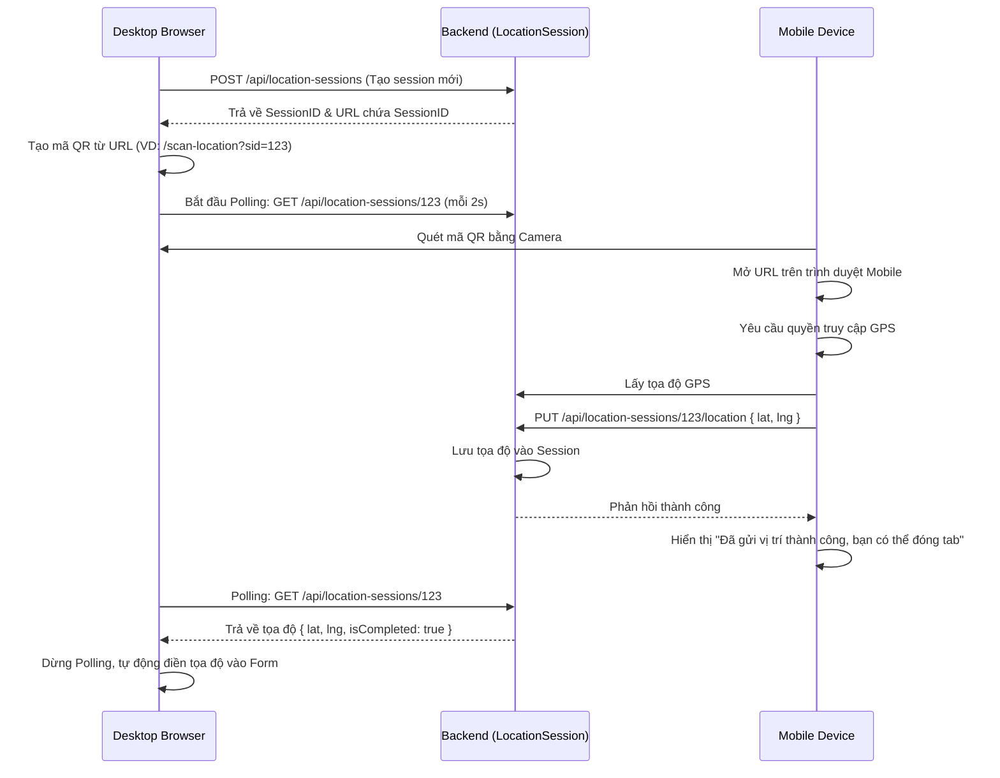

# 📍 Luồng Chia Sẻ Vị Trí Live (QR Scan)

## Tổng Quan

Tính năng Chia Sẻ Vị Trí Live cho phép người dùng (Citizen) sử dụng điện thoại di động để quét mã QR trên màn hình Desktop. Khi thiết bị di động gửi tọa độ GPS lên server, trình duyệt trên Desktop sẽ ngay lập tức nhận được tọa độ đó để điền vào form báo cáo rác thải.

---

## Sơ Đồ Luồng



---

## Chi Tiết Các Bước

### Bước 1: Desktop Tạo Session và Mã QR

**Actor**: Citizen (Trên Desktop)

1. Người dùng nhấn nút "Quét mã QR từ điện thoại để lấy vị trí" ở form Báo Cáo Rác.
2. Frontend Desktop gọi API:
   `POST /api/location-sessions`
3. Backend tạo Session ngẫu nhiên và lưu vào Redis hoặc Database tạm thời (Session hết hạn sau 15-30 phút).
4. Desktop hiển thị mã QR chứa URL: `https://.../scan-location?sid={sessionId}`
5. Desktop bắt đầu **Polling** liên tục bằng API `GET /api/location-sessions/{sessionId}` để kiểm tra.

---

### Bước 2: Mobile Quét Mã và Lấy Vị Trí

**Actor**: Citizen (Trên Mobile)

1. Công dân dùng ứng dụng Camera hoặc Zalo quét mã QR trên màn hình Desktop.
2. Trình duyệt trên Mobile mở trang `/scan-location` tự động lấy `sid` từ URL params.
3. Trình duyệt gọi HTML5 Geolocation API: `navigator.geolocation.getCurrentPosition()`.
4. Sau khi người dùng cấp quyền (Allow), trình duyệt lấy được `latitude` và `longitude`.
5. Mobile tự động gửi API để lưu vị trí:
   `PUT /api/location-sessions/{sessionId}/location`
   Body: `{"latitude": 10.7769, "longitude": 106.7009}`
6. Frontend Mobile hiển thị thông báo thành công: "Vị trí đã được cập nhật lên máy tính, bạn có thể đóng tab này".

---

### Bước 3: Desktop Nhận Vị Trí

1. Request Polling tiếp theo từ Desktop gọi:
   `GET /api/location-sessions/{sessionId}`
2. Lần này trả về dữ liệu vị trí:
   ```json
   {
       "sessionId": "12345-abcde",
       "latitude": 10.7769,
       "longitude": 106.7009,
       "status": "COMPLETED",
       "createdAt": "..."
   }
   ```
3. Màn hình quét QR trên Desktop tự động đóng lại.
4. Tọa độ được tự động điền vào Form báo cáo và hiển thị vị trí trên Bản đồ preview bằng VietMap API.

---

## Validation & Timeout

- Trạng thái ban đầu của Session là `PENDING`.
- Thời gian sống (TTL) của một Session thường là 15-30 phút để tránh lãng phí tài nguyên backend.
- Nếu Desktop gọi API kiểm tra session nhưng nhận được HTTP 404 (Không tìm thấy), nó sẽ ngưng Polling và hiển thị thông báo lỗi "Mã QR đã hết hạn, vui lòng tạo lại".
- Nếu người dùng Mobile từ chối quyền lấy GPS, màn hình Mobile sẽ hiển thị thông báo yêu cầu bật quyền GPS ở cài đặt và thử lại.

---

## Liên Hệ

- **Email**: pnhat.se@gmail.com
- **Đơn vị phát triển**: Grevo Team

---

© 2026 Grevo Solutions. Bảo lưu mọi quyền.
