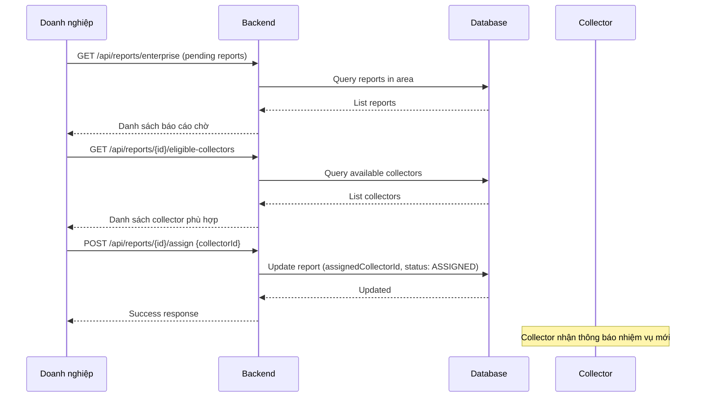
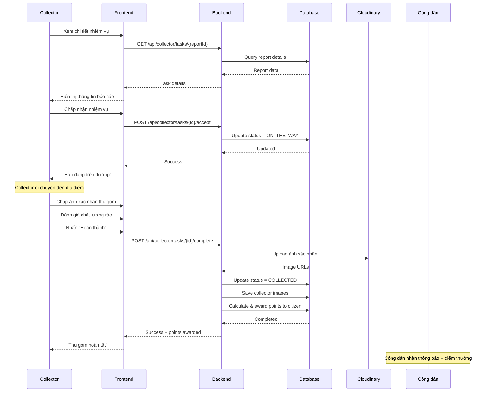
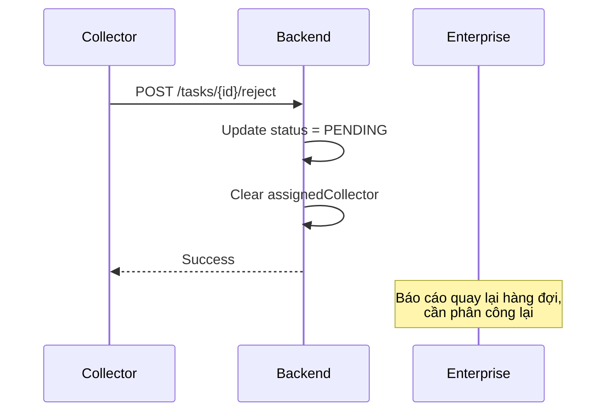
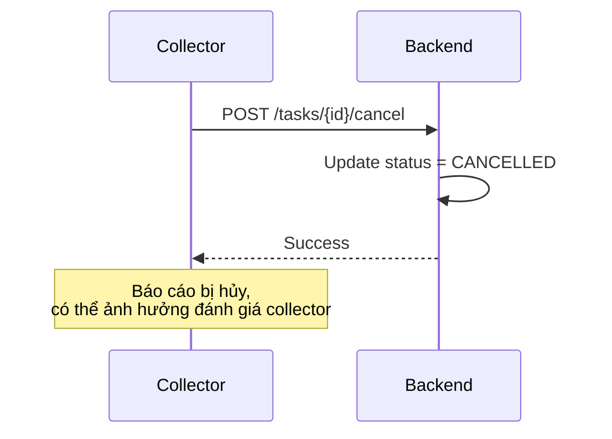

# 🚛 Luồng Thu Gom Rác Thải

## Tổng Quan

Luồng thu gom mô tả quy trình từ khi doanh nghiệp phân công collector đến khi hoàn thành thu gom.

---

## Sơ Đồ Luồng Phân Công



---

## Sơ Đồ Luồng Thu Gom



---

## Chi Tiết Các Bước

### Bước 1: Doanh Nghiệp Phân Công

**Actor**: Doanh nghiệp (ENTERPRISE)

**Hành động:**
1. Xem danh sách báo cáo `PENDING` trong khu vực
2. Xem chi tiết báo cáo (vị trí, loại rác, hình ảnh)
3. Lấy danh sách collector phù hợp
4. Chọn và phân công collector

**Tiêu chí chọn collector:**
- Đang online (`isOnline = true`)
- Trạng thái sẵn sàng (`currentStatus = AVAILABLE`)
- Thuộc cùng doanh nghiệp
- Phương tiện phù hợp với khối lượng

---

### Bước 2: Collector Nhận Nhiệm Vụ

**Actor**: Collector

**Trạng thái báo cáo**: `ASSIGNED`

**Lựa chọn của collector:**

| Hành động | API | Kết quả |
|-----------|-----|---------|
| Chấp nhận | POST .../accept | Status → ON_THE_WAY |
| Từ chối | POST .../reject | Status → PENDING, collector = null |

---

### Bước 3: Collector Di Chuyển

**Trạng thái báo cáo**: `ON_THE_WAY`

- Collector có thể xem địa chỉ, bản đồ
- Liên hệ công dân qua số điện thoại
- Có thể hủy nếu không thể hoàn thành

---

### Bước 4: Hoàn Thành Thu Gom

**Actor**: Collector

**Dữ liệu đầu vào:**
| Trường | Bắt buộc | Mô tả |
|--------|----------|-------|
| images | ❌ | Ảnh xác nhận thu gom |
| rating | ✅ | Đánh giá chất lượng rác (1-5) |
| wasteSortedCorrectly | ✅ | Rác được phân loại đúng không |
| citizenCooperative | ✅ | Công dân hợp tác không |
| notes | ❌ | Ghi chú |

**Xử lý Server:**
1. Upload ảnh collector lên Cloudinary
2. Lưu ảnh với sourceType = `COLLECTOR`
3. Tính quality score từ survey
4. Cập nhật status = `COLLECTED`
5. Tính điểm thưởng cho công dân
6. Tạo PointTransaction

---

## Công Thức Tính Điểm

```
Điểm = (Khối lượng × Điểm cơ bản) × Hệ số chất lượng + Bonus

Trong đó:
- Điểm cơ bản: 10 điểm/kg (có thể cấu hình)
- Hệ số chất lượng: 1.0 - 3.0 (dựa trên quality score)
- Bonus: Điểm thưởng nếu đạt khối lượng tối thiểu
```

**Ví dụ:**
- Khối lượng: 5kg
- Điểm cơ bản: 10
- Quality score: 4/5 → Hệ số: 1.5
- Bonus (>= 5kg): 20 điểm

```
Điểm = (5 × 10) × 1.5 + 20 = 75 + 20 = 95 điểm
```

---

## Các Trường Hợp Đặc Biệt

### Collector Từ Chối



### Collector Hủy Giữa Chừng



---

## Timeline Mẫu

```
09:00 - Công dân tạo báo cáo → PENDING
09:15 - Doanh nghiệp phân công → ASSIGNED
09:20 - Collector chấp nhận → ON_THE_WAY
09:45 - Collector đến nơi
09:50 - Thu gom xong, chụp ảnh
09:52 - Hoàn thành → COLLECTED
09:52 - Công dân nhận 95 điểm
```

---

## Liên Hệ

- **Email**: pnhat.se@gmail.com
- **Đơn vị phát triển**: Grevo Team

---

© 2026 Grevo Solutions. Bảo lưu mọi quyền.
