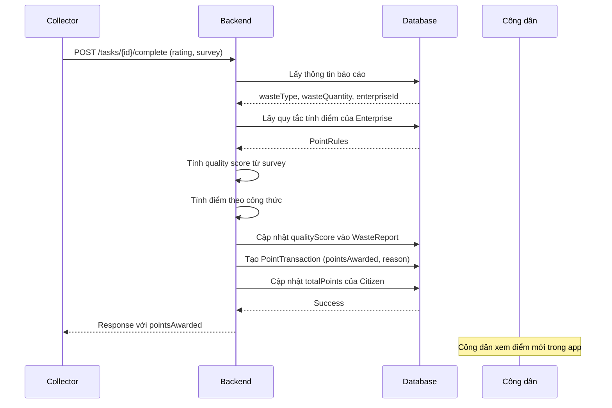
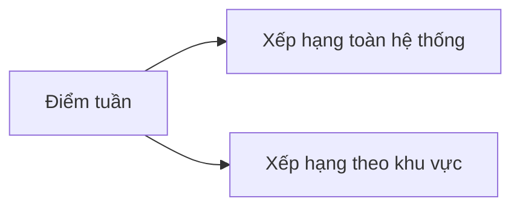

# 🎯 Luồng Tích Điểm

## Tổng Quan

Hệ thống tích điểm thưởng cho công dân mỗi khi báo cáo rác được thu gom thành công.

---

## Sơ Đồ Luồng



---

## Quy Tắc Tính Điểm (Point Rules)

### Cấu Trúc Quy Tắc

| Thuộc tính | Mô tả | Mặc định |
|------------|-------|----------|
| basePointsPerKg | Điểm cơ bản cho mỗi kg | 10 |
| qualityBonusMultiplier | Hệ số nhân khi chất lượng tốt | 1.0 - 3.0 |
| minQuantityForBonus | Khối lượng tối thiểu để nhận bonus | null |
| quantityBonus | Điểm bonus cố định | 0 |
| priority | Độ ưu tiên (cao hơn = ưu tiên) | 0 |

### Công Thức Tính

```
Điểm = (wasteQuantity × basePointsPerKg) × qualityMultiplier + quantityBonus
```

### Tính Quality Multiplier từ Survey

Survey gồm 3 yếu tố:
1. **rating** (1-5): Đánh giá chất lượng rác
2. **wasteSortedCorrectly** (true/false): Rác được phân loại đúng
3. **citizenCooperative** (true/false): Công dân hợp tác

```java
qualityScore = rating

if (wasteSortedCorrectly) qualityScore += 1
if (citizenCooperative) qualityScore += 1

// qualityScore: 1-7

qualityMultiplier = 1.0 + (qualityScore - 3) * 0.25
// Kết quả: 0.5 - 2.0
```

---

## Ví Dụ Tính Điểm

### Trường Hợp 1: Rác Tái Chế, Chất Lượng Tốt

**Thông tin báo cáo:**
- Loại rác: RECYCLABLE
- Khối lượng: 5 kg
- Rating: 5
- Phân loại đúng: ✅
- Hợp tác tốt: ✅

**Quy tắc Enterprise:**
- basePointsPerKg: 12
- minQuantityForBonus: 3 kg
- quantityBonus: 15

**Tính toán:**
```
qualityScore = 5 + 1 + 1 = 7
qualityMultiplier = 1.0 + (7-3) * 0.25 = 2.0

Điểm = (5 × 12) × 2.0 + 15 = 120 + 15 = 135 điểm
```

---

### Trường Hợp 2: Rác Hữu Cơ, Chất Lượng Trung Bình

**Thông tin báo cáo:**
- Loại rác: ORGANIC
- Khối lượng: 2 kg
- Rating: 3
- Phân loại đúng: ❌
- Hợp tác tốt: ✅

**Quy tắc Enterprise:**
- basePointsPerKg: 8
- minQuantityForBonus: 5 kg
- quantityBonus: 10

**Tính toán:**
```
qualityScore = 3 + 0 + 1 = 4
qualityMultiplier = 1.0 + (4-3) * 0.25 = 1.25

Điểm = (2 × 8) × 1.25 + 0 = 20 điểm
(không đủ 5kg nên không có bonus)
```

---

## Lịch Sử Điểm

### Cấu Trúc PointTransaction

| Trường | Mô tả |
|--------|-------|
| citizenId | ID công dân nhận điểm |
| reportId | Báo cáo liên quan (null nếu là chi tiêu) |
| pointsAwarded | Số điểm (+/- cho cộng/trừ) |
| reason | Lý do giao dịch |
| createdAt | Thời gian |

### Ví Dụ Lịch Sử

```json
[
    {
        "transactionId": 1,
        "reportId": 123,
        "pointsAwarded": 135,
        "reason": "Thu gom thành công - RECYCLABLE - 5.0kg",
        "createdAt": "2026-01-21T10:00:00"
    },
    {
        "transactionId": 2,
        "reportId": null,
        "pointsAwarded": -500,
        "reason": "Đổi voucher - Giảm 50k tại ABC Mart",
        "createdAt": "2026-01-21T11:00:00"
    }
]
```

---

## Thống Kê Điểm

### API Summary

```json
{
    "totalPoints": 1640,
    "weeklyPoints": 235,
    "monthlyPoints": 890,
    "transactionCount": 25
}
```

---

## Bảng Xếp Hạng

Điểm được sử dụng để xếp hạng công dân hàng tuần:



**Quy tắc:**
- Chỉ tính điểm từ đầu tuần (Thứ 2)
- Top 10 được hiển thị
- Reset hàng tuần

---

## Liên Hệ

- **Email**: pnhat.se@gmail.com
- **Đơn vị phát triển**: Grevo Team

---

© 2026 Grevo Solutions. Bảo lưu mọi quyền.
