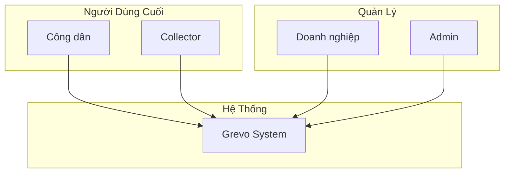
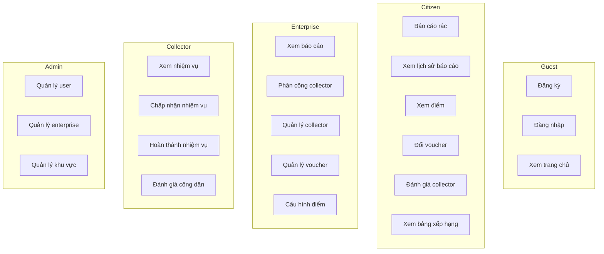

# 📋 Tài Liệu Đặc Tả Yêu Cầu Phần Mềm (SRS)
# Software Requirements Specification

---

## Thông Tin Tài Liệu

| Thông tin | Chi tiết |
|-----------|----------|
| **Tên dự án** | Grevo Solutions |
| **Phiên bản tài liệu** | 1.0 |
| **Ngày tạo** | 21/01/2026 |
| **Tác giả** | Pham Minh Nhat |
| **Email** | pnhat.se@gmail.com |
| **Pháp nhân** | Grevo Team |

---

## Mục Lục

1. [Giới Thiệu](#1-giới-thiệu)
2. [Mô Tả Tổng Quan](#2-mô-tả-tổng-quan)
3. [Yêu Cầu Chức Năng](#3-yêu-cầu-chức-năng)
4. [Yêu Cầu Phi Chức Năng](#4-yêu-cầu-phi-chức-năng)
5. [Các Actor Và Use Case](#5-các-actor-và-use-case)
6. [Giao Diện Người Dùng](#6-giao-diện-người-dùng)
7. [Ràng Buộc Hệ Thống](#7-ràng-buộc-hệ-thống)

---

## 1. Giới Thiệu

### 1.1. Mục Đích

Tài liệu này mô tả chi tiết các yêu cầu phần mềm cho hệ thống **Grevo Solutions** - Nền tảng quản lý thu gom rác thải thông minh. Tài liệu dùng làm cơ sở cho:
- Business Analyst (BA) phân tích nghiệp vụ
- Developer triển khai hệ thống
- Tester kiểm thử chức năng
- Stakeholder đánh giá tiến độ

### 1.2. Phạm Vi

Hệ thống Grevo Solutions bao gồm:
- **Ứng dụng Web** cho công dân, doanh nghiệp, nhân viên thu gom và quản trị viên
- **Backend API** xử lý nghiệp vụ
- **Database** lưu trữ dữ liệu
- **Cloud Storage** lưu trữ hình ảnh

### 1.3. Định Nghĩa & Thuật Ngữ

| Thuật ngữ | Định nghĩa |
|-----------|------------|
| Công dân (Citizen) | Người dân sử dụng hệ thống để báo cáo rác thải |
| Doanh nghiệp (Enterprise) | Đơn vị quản lý và điều phối thu gom trong khu vực |
| Collector | Nhân viên thu gom rác thải |
| Báo cáo (Report) | Yêu cầu thu gom rác từ công dân |
| Điểm (Points) | Đơn vị thưởng cho công dân |
| Voucher | Phiếu ưu đãi đổi bằng điểm |

### 1.4. Tài Liệu Tham Khảo

- Tài liệu API: `/02-api-documentation/`
- Sơ đồ CSDL: `/03-co-so-du-lieu/`
- Luồng xử lý: `/04-luong-xu-ly/`

---

## 2. Mô Tả Tổng Quan

### 2.1. Tầm Nhìn Sản Phẩm

Grevo Solutions hướng đến việc số hóa quy trình thu gom rác thải, tạo động lực cho công dân phân loại rác thông qua hệ thống điểm thưởng, đồng thời giúp doanh nghiệp quản lý hiệu quả đội ngũ thu gom.

### 2.2. Các Bên Liên Quan

### 2.3. Môi Trường Hoạt Động

| Môi trường | Chi tiết |
|------------|----------|
| Web Browser | Chrome, Firefox, Safari, Edge (phiên bản mới nhất) |
| Mobile | Responsive design trên iOS/Android browser |
| Server | Linux-based cloud server |
| Database | MySQL 8.0+ |

---

## 3. Yêu Cầu Chức Năng

### 3.1. Module Xác Thực (AUTH)

#### FR-AUTH-001: Đăng ký tài khoản
| Thuộc tính | Mô tả |
|------------|-------|
| **Mô tả** | Người dùng mới có thể tạo tài khoản |
| **Actor** | Guest |
| **Tiền điều kiện** | Chưa có tài khoản |
| **Luồng chính** | 1. Nhập thông tin (email, password, họ tên, SĐT) |
|  | 2. Chọn role (Citizen/Enterprise/Collector) |
|  | 3. Submit form |
|  | 4. Hệ thống validate và tạo tài khoản |
| **Hậu điều kiện** | Tài khoản được tạo, trả về JWT token |
| **Ngoại lệ** | Email đã tồn tại → Thông báo lỗi |
| **Độ ưu tiên** | Cao |

#### FR-AUTH-002: Đăng nhập
| Thuộc tính | Mô tả |
|------------|-------|
| **Mô tả** | Người dùng đăng nhập vào hệ thống |
| **Actor** | Registered User |
| **Tiền điều kiện** | Có tài khoản |
| **Luồng chính** | 1. Nhập email và password |
|  | 2. Submit form |
|  | 3. Hệ thống xác thực và trả về token |
| **Hậu điều kiện** | Nhận JWT token, redirect theo role |
| **Ngoại lệ** | Sai thông tin → "Username or Password is wrong" |
| **Độ ưu tiên** | Cao |

#### FR-AUTH-003: Đăng nhập bằng Google
| Thuộc tính | Mô tả |
|------------|-------|
| **Mô tả** | Đăng nhập nhanh bằng tài khoản Google |
| **Actor** | Guest / Registered User |
| **Luồng chính** | 1. Click "Đăng nhập bằng Google" |
|  | 2. Chọn tài khoản Google |
|  | 3. Hệ thống verify token và đăng nhập/tạo tài khoản |
| **Độ ưu tiên** | Trung bình |

---

### 3.2. Module Công Dân (CITIZEN)

#### FR-CIT-001: Tạo báo cáo rác thải
| Thuộc tính | Mô tả |
|------------|-------|
| **Mô tả** | Công dân báo cáo rác cần thu gom |
| **Actor** | Citizen |
| **Tiền điều kiện** | Đã đăng nhập với role CITIZEN |
| **Input** | Tiêu đề, mô tả, loại rác, hình ảnh, vị trí GPS |
| **Luồng chính** | 1. Cho phép truy cập GPS |
|  | 2. Chụp/chọn ảnh rác |
|  | 3. Chọn loại rác |
|  | 4. Nhập mô tả (optional) |
|  | 5. Submit báo cáo |
| **Hậu điều kiện** | Báo cáo được tạo với status PENDING |
| **Độ ưu tiên** | Cao |

#### FR-CIT-002: Xem lịch sử báo cáo
| Thuộc tính | Mô tả |
|------------|-------|
| **Mô tả** | Xem danh sách và chi tiết các báo cáo đã tạo |
| **Actor** | Citizen |
| **Output** | Danh sách báo cáo với pagination, filter theo status |
| **Độ ưu tiên** | Cao |

#### FR-CIT-003: Xem thống kê cá nhân
| Thuộc tính | Mô tả |
|------------|-------|
| **Mô tả** | Xem tổng hợp số báo cáo, điểm tích lũy |
| **Actor** | Citizen |
| **Output** | totalReports, completedReports, totalPoints, totalWasteKg |
| **Độ ưu tiên** | Trung bình |

#### FR-CIT-004: Xem lịch sử điểm
| Thuộc tính | Mô tả |
|------------|-------|
| **Mô tả** | Xem chi tiết giao dịch điểm |
| **Actor** | Citizen |
| **Output** | Danh sách transaction với amount, reason, date |
| **Độ ưu tiên** | Trung bình |

#### FR-CIT-005: Xem voucher có sẵn
| Thuộc tính | Mô tả |
|------------|-------|
| **Mô tả** | Xem danh sách voucher có thể đổi |
| **Actor** | Citizen |
| **Output** | Voucher với title, pointsCost, remainingStock |
| **Độ ưu tiên** | Trung bình |

#### FR-CIT-006: Đổi voucher
| Thuộc tính | Mô tả |
|------------|-------|
| **Mô tả** | Sử dụng điểm để đổi voucher |
| **Actor** | Citizen |
| **Tiền điều kiện** | totalPoints >= pointsCost |
| **Luồng chính** | 1. Chọn voucher |
|  | 2. Xác nhận đổi |
|  | 3. Trừ điểm, tạo mã đổi thưởng |
| **Hậu điều kiện** | Nhận redemptionCode |
| **Độ ưu tiên** | Trung bình |

#### FR-CIT-007: Đánh giá nhân viên thu gom
| Thuộc tính | Mô tả |
|------------|-------|
| **Mô tả** | Đánh giá collector sau khi thu gom xong |
| **Actor** | Citizen |
| **Tiền điều kiện** | Báo cáo ở trạng thái COLLECTED |
| **Input** | starRating (1-5), description, images |
| **Độ ưu tiên** | Thấp |

#### FR-CIT-008: Xem bảng xếp hạng
| Thuộc tính | Mô tả |
|------------|-------|
| **Mô tả** | Xem top công dân theo điểm tuần |
| **Actor** | Citizen |
| **Output** | Top 10 với rank, name, points |
| **Độ ưu tiên** | Thấp |

---

### 3.3. Module Doanh Nghiệp (ENTERPRISE)

#### FR-ENT-001: Xem báo cáo cần xử lý
| Thuộc tính | Mô tả |
|------------|-------|
| **Mô tả** | Xem danh sách báo cáo PENDING trong khu vực |
| **Actor** | Enterprise |
| **Output** | Danh sách báo cáo với thông tin công dân, vị trí |
| **Độ ưu tiên** | Cao |

#### FR-ENT-002: Phân công collector
| Thuộc tính | Mô tả |
|------------|-------|
| **Mô tả** | Gán collector cho báo cáo |
| **Actor** | Enterprise |
| **Luồng chính** | 1. Xem danh sách collector phù hợp |
|  | 2. Chọn collector |
|  | 3. Xác nhận phân công |
| **Hậu điều kiện** | Status → ASSIGNED |
| **Độ ưu tiên** | Cao |

#### FR-ENT-003: Quản lý collector
| Thuộc tính | Mô tả |
|------------|-------|
| **Mô tả** | Xem, duyệt, xóa collector |
| **Actor** | Enterprise |
| **Chức năng con** | Duyệt yêu cầu gia nhập, Xóa collector, Duyệt/Từ chối nghỉ phép |
| **Độ ưu tiên** | Cao |

#### FR-ENT-004: Quản lý voucher
| Thuộc tính | Mô tả |
|------------|-------|
| **Mô tả** | CRUD voucher của doanh nghiệp |
| **Actor** | Enterprise |
| **Chức năng con** | Tạo, sửa, xóa, xem lịch sử đổi |
| **Độ ưu tiên** | Trung bình |

#### FR-ENT-005: Cấu hình quy tắc tính điểm
| Thuộc tính | Mô tả |
|------------|-------|
| **Mô tả** | CRUD point rules |
| **Actor** | Enterprise |
| **Input** | basePointsPerKg, qualityBonusMultiplier, quantityBonus |
| **Độ ưu tiên** | Trung bình |

---

### 3.4. Module Collector (COLLECTOR)

#### FR-COL-001: Xem danh sách nhiệm vụ
| Thuộc tính | Mô tả |
|------------|-------|
| **Mô tả** | Xem các task được phân công |
| **Actor** | Collector |
| **Output** | Danh sách task với filter theo status |
| **Độ ưu tiên** | Cao |

#### FR-COL-002: Chấp nhận nhiệm vụ
| Thuộc tính | Mô tả |
|------------|-------|
| **Mô tả** | Nhận task và bắt đầu thu gom |
| **Actor** | Collector |
| **Tiền điều kiện** | Status = ASSIGNED |
| **Hậu điều kiện** | Status → ON_THE_WAY |
| **Độ ưu tiên** | Cao |

#### FR-COL-003: Hoàn thành nhiệm vụ
| Thuộc tính | Mô tả |
|------------|-------|
| **Mô tả** | Đánh dấu task hoàn thành |
| **Actor** | Collector |
| **Input** | images, rating, wasteSortedCorrectly, citizenCooperative |
| **Hậu điều kiện** | Status → COLLECTED, Citizen nhận điểm |
| **Độ ưu tiên** | Cao |

#### FR-COL-004: Từ chối/Hủy nhiệm vụ
| Thuộc tính | Mô tả |
|------------|-------|
| **Mô tả** | Không thể hoàn thành task |
| **Actor** | Collector |
| **Kết quả từ chối** | Status → PENDING, cần phân công lại |
| **Kết quả hủy** | Status → CANCELLED |
| **Độ ưu tiên** | Trung bình |

#### FR-COL-005: Xin gia nhập/rời doanh nghiệp
| Thuộc tính | Mô tả |
|------------|-------|
| **Mô tả** | Gửi yêu cầu join/leave enterprise |
| **Actor** | Collector |
| **Độ ưu tiên** | Thấp |

---

### 3.5. Module Admin (ADMIN)

#### FR-ADM-001: Quản lý người dùng
| Thuộc tính | Mô tả |
|------------|-------|
| **Mô tả** | CRUD users của hệ thống |
| **Actor** | Admin |
| **Chức năng** | Xem, sửa, xóa, reset password |
| **Độ ưu tiên** | Cao |

#### FR-ADM-002: Quản lý khu vực dịch vụ
| Thuộc tính | Mô tả |
|------------|-------|
| **Mô tả** | CRUD service areas |
| **Actor** | Admin |
| **Độ ưu tiên** | Trung bình |

#### FR-ADM-003: Gán doanh nghiệp cho khu vực
| Thuộc tính | Mô tả |
|------------|-------|
| **Mô tả** | Phân quyền enterprise phụ trách area |
| **Actor** | Admin |
| **Độ ưu tiên** | Trung bình |

---

## 4. Yêu Cầu Phi Chức Năng

### 4.1. Hiệu Năng (Performance)

| ID | Yêu cầu | Metrics |
|----|---------|---------|
| NFR-PER-001 | API response time | < 500ms (P95) |
| NFR-PER-002 | Page load time | < 3s |
| NFR-PER-003 | Concurrent users | 1000+ users |
| NFR-PER-004 | Image upload | < 5MB, < 5s |

### 4.2. Bảo Mật (Security)

| ID | Yêu cầu |
|----|---------|
| NFR-SEC-001 | Xác thực bằng JWT token |
| NFR-SEC-002 | Password được hash (BCrypt) |
| NFR-SEC-003 | HTTPS cho tất cả requests |
| NFR-SEC-004 | CORS policy configured |
| NFR-SEC-005 | Role-based access control |
| NFR-SEC-006 | SQL injection prevention (JPA) |

### 4.3. Khả Dụng (Availability)

| ID | Yêu cầu | Metrics |
|----|---------|---------|
| NFR-AVA-001 | Uptime | 99.5% |
| NFR-AVA-002 | Planned downtime | < 4h/month |
| NFR-AVA-003 | Error rate | < 0.1% |

### 4.4. Khả Năng Mở Rộng (Scalability)

| ID | Yêu cầu |
|----|---------|
| NFR-SCA-001 | Horizontal scaling support |
| NFR-SCA-002 | Database connection pooling |
| NFR-SCA-003 | Stateless API design |

### 4.5. Tương Thích (Compatibility)

| ID | Yêu cầu |
|----|---------|
| NFR-COM-001 | Chrome 90+, Firefox 88+, Safari 14+, Edge 90+ |
| NFR-COM-002 | Responsive: Desktop, Tablet, Mobile |
| NFR-COM-003 | JavaScript enabled required |

### 4.6. Khả Năng Bảo Trì (Maintainability)

| ID | Yêu cầu |
|----|---------|
| NFR-MAI-001 | Code documentation |
| NFR-MAI-002 | API documentation (Swagger) |
| NFR-MAI-003 | Logging for debugging |
| NFR-MAI-004 | Version control (Git) |

---

## 5. Các Actor Và Use Case

### 5.1. Use Case Diagram

### 5.2. Actor Summary

| Actor | Mô tả | Số use case |
|-------|-------|-------------|
| Guest | Người chưa đăng nhập | 3 |
| Citizen | Công dân đăng ký | 6 |
| Enterprise | Đơn vị thu gom | 5 |
| Collector | Nhân viên thu gom | 4 |
| Admin | Quản trị viên | 3 |

---

## 6. Giao Diện Người Dùng

### 6.1. Danh Sách Màn Hình

| Màn hình | Role | Mô tả |
|----------|------|-------|
| Trang chủ | All | Landing page |
| Đăng nhập | Guest | Form login |
| Đăng ký | Guest | Form register |
| Dashboard Citizen | Citizen | Thống kê, báo cáo gần đây |
| Tạo báo cáo | Citizen | Form tạo report |
| Lịch sử báo cáo | Citizen | List + Detail reports |
| Đổi thưởng | Citizen | Voucher store |
| Dashboard Enterprise | Enterprise | Thống kê, reports cần xử lý |
| Quản lý collector | Enterprise | List collectors |
| Quản lý voucher | Enterprise | CRUD vouchers |
| Dashboard Collector | Collector | Nhiệm vụ hôm nay |
| Chi tiết nhiệm vụ | Collector | Task detail + actions |
| Dashboard Admin | Admin | System stats |
| Quản lý users | Admin | User management |

### 6.2. Wireframe Notes

- Design responsive với breakpoints: Mobile (< 768px), Tablet (768-1024px), Desktop (> 1024px)
- Dark mode support
- Sử dụng Material Design principles
- Animation với Framer Motion

---

## 7. Ràng Buộc Hệ Thống

### 7.1. Ràng Buộc Kỹ Thuật

| Ràng buộc | Chi tiết |
|-----------|----------|
| Backend framework | Spring Boot 4.0+ |
| Frontend framework | React 18+ |
| Database | MySQL 8.0+ |
| Java version | 21 LTS |
| Node version | 18+ |

### 7.2. Ràng Buộc Nghiệp Vụ

| Ràng buộc | Chi tiết |
|-----------|----------|
| Khu vực phục vụ | Chỉ trong ServiceArea đã định nghĩa |
| Loại rác | 4 loại: Organic, Recyclable, Hazardous, General |
| Điểm thưởng | Không thể chuyển cho người khác |
| Voucher | Chỉ công dân mới được đổi |

### 7.3. Giả Định

- Người dùng có smartphone với GPS
- Có kết nối internet ổn định
- Người dùng có email hợp lệ
- Browser hỗ trợ JavaScript

---

## Lịch Sử Thay Đổi

| Version | Ngày | Tác giả | Mô tả |
|---------|------|---------|-------|
| 1.0 | 21/01/2026 | Pham Minh Nhat | Phiên bản đầu tiên |

---

## Liên Hệ

- **Email**: pnhat.se@gmail.com
- **Đơn vị phát triển**: Grevo Team

---

© 2026 Grevo Solutions. Bảo lưu mọi quyền.
